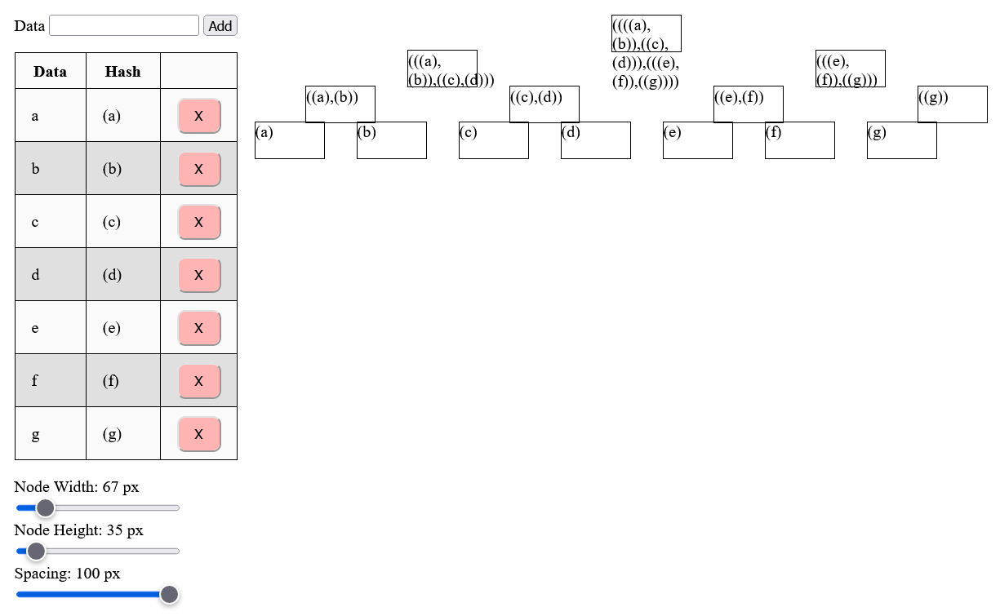
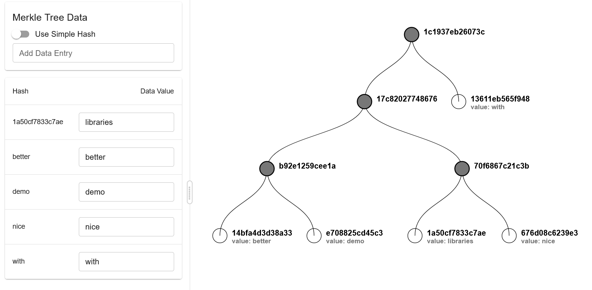

# Merkle Tree Visualizsation Demo

2 examples are in this directory.

## Basic Example w/ no dependencies

Open `trees.html` using a browser.



## Pretty Example



Under `blockchain-intro`

Use a package manager to install the

```
cd blockchain-intro

npm install
npm run dev
```
